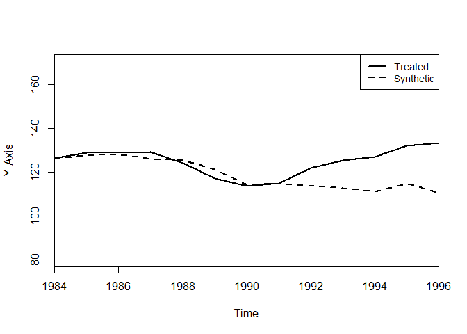
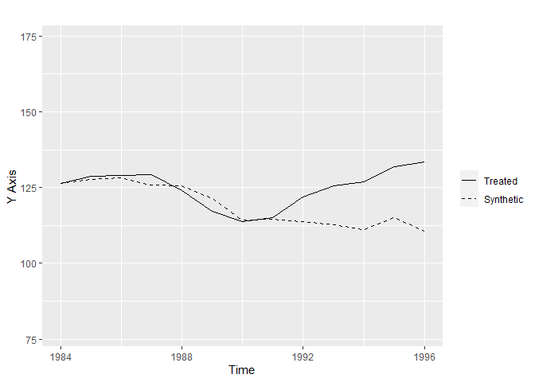
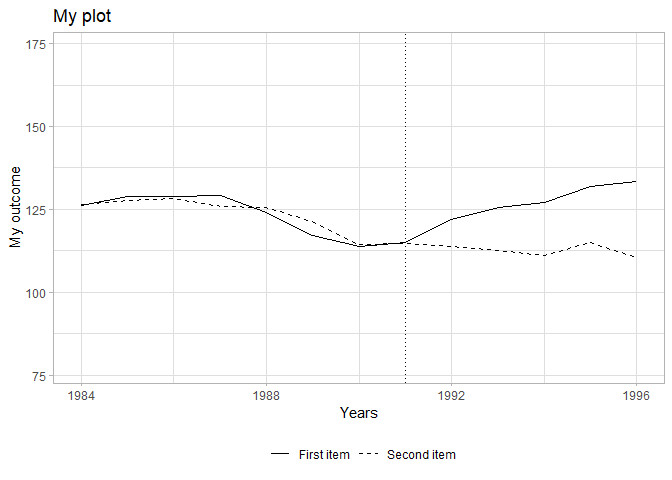
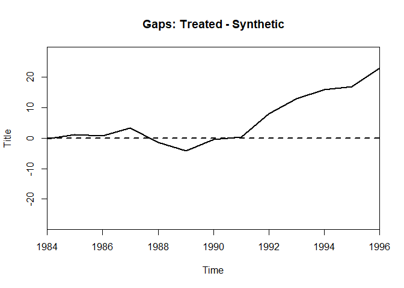
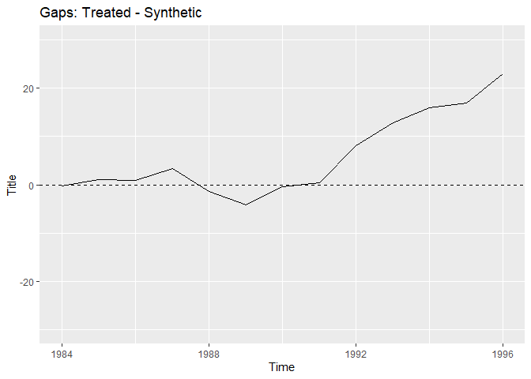

This repository shows how to add an argument `ggplot = TRUE/FALSE` to
the functions `path.plot()` and `gaps.plot()` in the package `Synth`.
The functions can be found in `ggplot-synth.R`

## Examples

**Setup:** I simply re-use examples of `Synth::synth()`.

``` r
library(Synth)
library(ggplot2)

source("ggplot-synth.R")


data(synth.data)

dataprep.out<- dataprep(
   foo = synth.data,
   predictors = c("X1", "X2", "X3"),
   predictors.op = "mean",
   dependent = "Y",
   unit.variable = "unit.num",
   time.variable = "year",
   special.predictors = list(
      list("Y", 1991, "mean"),
      list("Y", 1985, "mean"),
      list("Y", 1980, "mean")
                            ),
   treatment.identifier = 7,
   controls.identifier = c(29, 2, 13, 17, 32, 38),
   time.predictors.prior = c(1984:1989),
   time.optimize.ssr = c(1984:1990),
   unit.names.variable = "name",
   time.plot = 1984:1996
   )

synth.out <- synth(dataprep.out)
```

    ## 
    ## X1, X0, Z1, Z0 all come directly from dataprep object.
    ## 
    ## 
    ## **************** 
    ##  searching for synthetic control unit  
    ##  
    ## 
    ## **************** 
    ## **************** 
    ## **************** 
    ## 
    ## MSPE (LOSS V): 4.714688 
    ## 
    ## solution.v:
    ##  0.00490263 0.003884407 0.1972011 0.2707289 0.0007091301 0.5225738 
    ## 
    ## solution.w:
    ##  0.0001407318 0.004851527 0.1697786 0.2173031 0.6079231 2.9419e-06

## Path plot

**Default**

``` r
path.plot(dataprep.res = dataprep.out, synth.res = synth.out)
```

<!-- -->

**Custom**

``` r
my_path_plot(dataprep.res = dataprep.out, synth.res = synth.out, ggplot = TRUE)
```

    ## Warning in my_path_plot(dataprep.res = dataprep.out, synth.res = synth.out, :
    ## Argument `Legend.position` doesn't work when `ggplot = TRUE`.

<!-- -->

``` r
my_path_plot(dataprep.res = dataprep.out, synth.res = synth.out, ggplot = TRUE) +
  ggplot2::theme_light()
```

    ## Warning in my_path_plot(dataprep.res = dataprep.out, synth.res = synth.out, :
    ## Argument `Legend.position` doesn't work when `ggplot = TRUE`.

<!-- -->

## Gap plot

**Default**

``` r
gaps.plot(dataprep.res = dataprep.out, synth.res = synth.out)
```

<!-- -->

**Custom**

``` r
my_gaps_plot(dataprep.res = dataprep.out, synth.res = synth.out, ggplot = TRUE)
```

<!-- -->

``` r
my_gaps_plot(dataprep.res = dataprep.out, synth.res = synth.out, ggplot = TRUE) +
  ggplot2::theme_light()
```

<!-- -->
